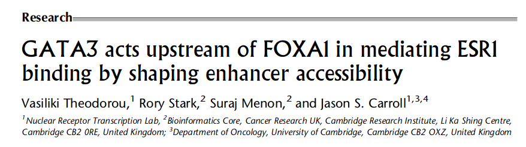
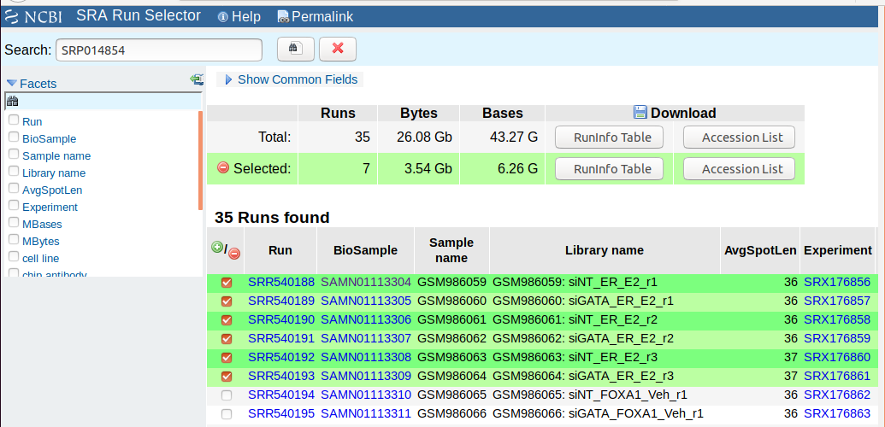
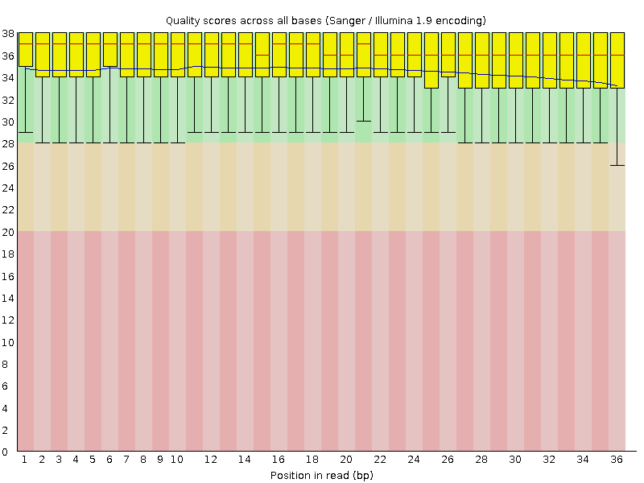
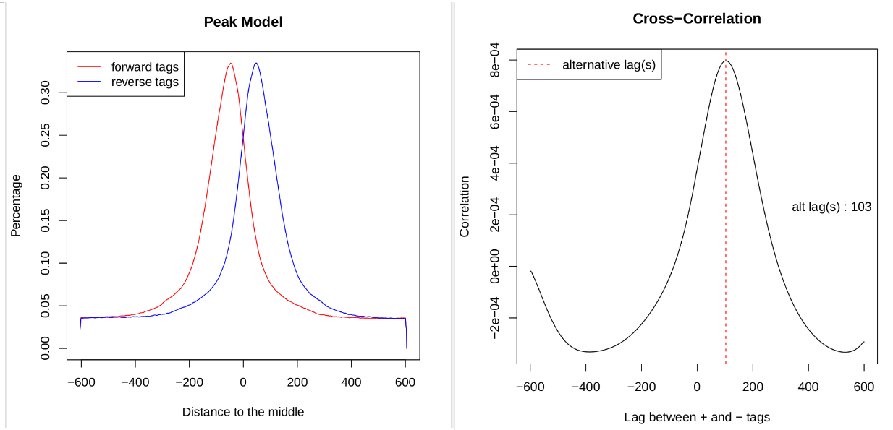
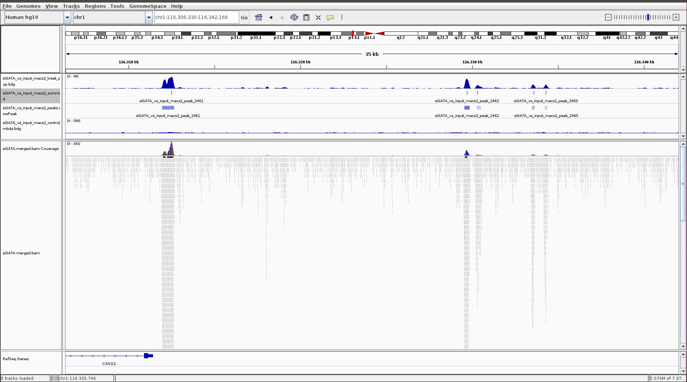
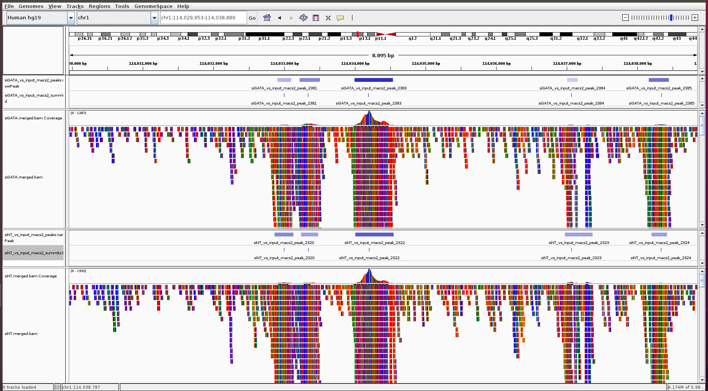

ChIP-seq pipeline
=================

A bioinformatics pipeline to perform a basic ChIP-seq analysis, from getting the FASTQ files, read preprocessing and mapping to peak calling.

It explains the steps of the analysis and provides Perl and bash scripts (`script` folder) to run the analysis automatically with a few commands in the [last section](https://github.com/alfonsosaera/ChIPseq#automate-the-analysis).

Annotation and differential binding analysis of peaks will be included in future versions of this pipeline.

Dataset
=======

I will use the dataset published in by [Theodorou et al. Genome Research 2013, 23: 12-22](https://www.ncbi.nlm.nih.gov/pubmed/23172872/)



They perform ChIP-seq of estrogen-receptor (ESR1) in wt vs GATA3 silencing conditions (siGATA3) to understand how GATA3 regulates ESR1 binding.

The table below show the datasets used, stored in GEO database with the accession [GSE40129](https://www.ncbi.nlm.nih.gov/geo/query/acc.cgi?acc=GSE40129).

| BioSample    | Experiment | SRA\_Sample | Run       | Exp\_Name          | replicate |
|--------------|------------|-------------|-----------|--------------------|:---------:|
| SAMN01113304 | SRX176856  | SRS356212   | SRR540188 | siNT\_ER\_E2\_r1   |     r1    |
| SAMN01113305 | SRX176857  | SRS356213   | SRR540189 | siGATA\_ER\_E2\_r1 |     r1    |
| SAMN01113306 | SRX176858  | SRS356214   | SRR540190 | siNT\_ER\_E2\_r2   |     r2    |
| SAMN01113307 | SRX176859  | SRS356215   | SRR540191 | siGATA\_ER\_E2\_r2 |     r2    |
| SAMN01113308 | SRX176860  | SRS356216   | SRR540192 | siNT\_ER\_E2\_r3   |     r3    |
| SAMN01113309 | SRX176861  | SRS356217   | SRR540193 | siGATA\_ER\_E2\_r3 |     r3    |
| SAMN01113336 | SRX176888  | SRS356244   | SRR540220 | MCF\_input\_r3     |     r3    |

The sample information of all datasets, or just the selected ones, can be downloaded from the [NCBI SRA Run Selector](https://www.ncbi.nlm.nih.gov/Traces/study/?acc=SRP014854) by clicking `RunInfo Table`. 

Raw data download
=================

To download the FASTQ files, we need the RUN number of each sample and `fastq-dump`, or its faster version `fasterq-dump`, from the [`SRA Toolkit`](https://www.ncbi.nlm.nih.gov/sra/docs/toolkitsoft/).

We can manually download each one as below

``` shell
fasterq-dump SRR540188 
fasterq-dump SRR540189 
...
fasterq-dump SRR540193 
fasterq-dump SRR540220
```

or use the `fastq-dump_SRRlist.sh` script

``` shell
#! /bin/bash

# Modify SRA_toolkit_path as needed
files=`cat SRR_Acc_List.txt`
SRA_toolkit_path="/mnt/518D6BCF3ECC578E/sratoolkit.current-ubuntu64/sratoolkit.2.9.2-ubuntu64/bin"

for i in $files
  do
    # $SRA_toolkit_path/fastq-dump --split-3 --gzip --accession $i
    $SRA_toolkit_path/fasterq-dump $i
  done
```

that will read the RUN codes from the `SRR_Acc_List.txt` file that can be also downloaded from the [NCBI SRA Run Selector](https://www.ncbi.nlm.nih.gov/Traces/study/?acc=SRP014854) by clicking `AccessionList`.

``` shell
SRR540188
SRR540189
...
SRR540220
```

Just move the script (make it executable with `chmod`) and the `SRR_Acc_List.txt` file to the desired folder (e.g. fastq) and execute it as shown below.

``` shell
./fastq-dump_SRRlist.sh
```

Alternatively this can also be done directly from the terminal

``` shell
cat SRR_Acc_List.txt | while read id; do fasterq-dump $id; done
```

Read preprocessing
==================

This step performs adapter and quality trimming. Quality evaulation is done with [`fastqc`](https://www.bioinformatics.babraham.ac.uk/projects/download.html) and [`bbuk`](https://jgi.doe.gov/data-and-tools/bbtools/bb-tools-user-guide/installation-guide/) for the trimming.

fastqc can be run with the following code

``` shell
fastqc SRR540188.fastq
```



and `bbduk` as follows

``` shell
bbduk.sh in=SRR540188.fastq out=SRR540188.trim.fastq minlen=25 qtrim=r trimq=10
```

with the settings minimum size 25 bp and minimum quality score 10. Then, the quality of the resulting FASTQ file can be checked again.

``` shell
fastqc SRR540188.trim.fastq
```

The `preprocessing_SE.pl` script performs all these steps automatically for all FASTQ files.

``` shell
./preprocessing_SE.pl
```

Initial quality analysis reports are saved in the `results/fastqc` folder. Trimmed FASTQ files are saved in the `results/tr_fastq` folder and the final quality reports in the `results/tr_fastq/fastqc` folder. The terminal output for one sample is shown below.

    Processing SRR540188

    FASTQC before trimming

    Started analysis of SRR540188.fastq
    Approx 5% complete for SRR540188.fastq
    ...
    Approx 95% complete for SRR540188.fastq
    Analysis complete for SRR540188.fastq

    Trimming step

    java -ea -Xmx9766m -Xms9766m -cp /mnt/518D6BCF3ECC578E/BBMap_38.32/bbmap/current/ jgi.BBDukF in=/mnt/518D6BCF3ECC578E/ChIP-seq/fastq/SRR540188.fastq out=/mnt/518D6BCF3ECC578E/ChIP-seq/results/tr_fastq/SRR540188.trim.fastq minlen=25 qtrim=r trimq=10
    Executing jgi.BBDukF [in=/mnt/518D6BCF3ECC578E/ChIP-seq/fastq/SRR540188.fastq, out=/mnt/518D6BCF3ECC578E/ChIP-seq/results/tr_fastq/SRR540188.trim.fastq, minlen=25, qtrim=r, trimq=10]
    Version 38.32

    0.022 seconds.
    Initial:
    Memory: max=10242m, total=10242m, free=10218m, used=24m

    Input is being processed as unpaired
    Started output streams: 0.013 seconds.
    Processing time:        49.322 seconds.

    Input:                      29991295 reads      1079686620 bases.
    QTrimmed:                   1344332 reads (4.48%)   17896547 bases (1.66%)
    Total Removed:              365851 reads (1.22%)    17896547 bases (1.66%)
    Result:                     29625444 reads (98.78%)     1061790073 bases (98.34%)

    Time:                           49.336 seconds.
    Reads Processed:      29991k    607.89k reads/sec
    Bases Processed:       1079m    21.88m bases/sec

    FASTQC after trimming

    Started analysis of SRR540188.trim.fastq
    Approx 5% complete for SRR540188.trim.fastq
    ...
    Approx 95% complete for SRR540188.trim.fastq
    Analysis complete for SRR540188.trim.fastq

The whole output is in the `preprocessing_SE.log` file.

Reads alignment
===============

`bowtie2`, a fast and memory-efficient tool for aligning sequencing reads to long reference sequences, was selected to align the trimmed FASTQ files. It is particularly good at aligning reads of about 50 up to 100s of characters to relatively long (e.g. mammalian) genomes. `bowtie2` indexes the genome with an [FM Index](https://en.wikipedia.org/wiki/FM-index), indexes for most common genomes can be found at Illumina's [iGenomes](https://support.illumina.com/sequencing/sequencing_software/igenome.html) collection.

`bowtie2` outputs the alignment in SAM format. The it needs to be converted to BAM format, sorted and indexed. The code below does all this. [SAM Tools](http://samtools.sourceforge.net/) provide various utilities for manipulating alignments in the SAM format.

``` shell
bowtie2 -p 3 -x human_index/genome -U SRR540188.trim.fastq -S SRR540188.sam

# convert to BAM, sort and index
samtools view --threads 2 -bS SRR540188.sam > SRR540188.bam
samtools sort --threads 2 SRR540188.bam -o SRR540188.sorted.bam
samtools index -@ 2 SRR540188.sorted.bam
```

A faster option is to pipe `bowtie2` with `samtools sort`. This also saves hard drive space by not producing the SAM and the BAM file.

``` shell
bowtie2 -p 3 -x human_index/genome -U SRR540188.trim.fastq | \
        samtools sort --threads 2 -o SRR540188.sorted.bam

# index sorted.bam
samtools index -@ 2 SRR540188.sorted.bam
```

The `alignment_SE.sh` script performs all these steps automatically for all trimmed FASTQ files.

``` shell
./alignment_SE.sh
```

BAM files are saved in the `results/bowtie2_alignment` folder. The terminal output for one sample is shown below.

    11:42:38 - Processing sample SRR540192
    11:42:38 - bowtie2_alignment step
    33796642 reads; of these:
      33796642 (100.00%) were unpaired; of these:
        206048 (0.61%) aligned 0 times
        26798960 (79.29%) aligned exactly 1 time
        6791634 (20.10%) aligned >1 times
    99.39% overall alignment rate
    [bam_sort_core] merging from 6 files and 2 in-memory blocks...
    12:02:33 - indexing bam file
    SRR540192 processing time:
        0 h., 20 min., 3 secs.

The whole output is in the `alignment_SE.log` file.

Peak calling
============

Once aligned, ChIP peaks, genomic regions where the ChIPed protein is bound that have with significant numbers of mapped reads, must be identified. [MACS2](https://pypi.org/project/MACS2/), maybe the most popular method, empirically models the shift size of ChIP-seq tags to get better resolution of the predicted peaks.

Merging BAM files of the technical and/or biological replicates can improve the sensitivity of the peak calling by increasing the depth of read coverage. Again, [SAM Tools](http://samtools.sourceforge.net/) can merge different BAM files and then index the merged BAM file.

``` shell
# WT samples: SRR540188 SRR540190 SRR540192
samtools merge -@ 2 results/siNT.merged.bam \
               results/bowtie2_alignment/SRR540188.sorted.bam \
               results/bowtie2_alignment/SRR540190.sorted.bam\
               results/bowtie2_alignment/SRR540192.sorted.bam
samtools index -@ 2 results/siNT.merged.bam

# GATA samples: SRR540189 SRR540191 SRR540193
samtools merge -@ 2 results/siGATA.merged.bam \
               results/bowtie2_alignment/SRR540189.sorted.bam \
               results/bowtie2_alignment/SRR540191.sorted.bam\
               results/bowtie2_alignment/SRR540193.sorted.bam
samtools index -@ 2 results/siGATA.merged.bam
```

The `mergeBAM_ESR1.sh` script will do this automatically and time it.

``` shell
./mergeBAM_ESR1.sh
```

The terminal output is shown below and saved in the `mergeBAM_ESR1.log` file

    ./mergeBAM_ESR1.sh

    ************************************************
    *               MERGING BAM FILES              *
    ************************************************

    19:34:46 Running file: ./mergeBAM_ESR1.sh

    19:34:46 WT BAM files


    19:40:21 GATA BAM files


    19:45:07 ./mergeBAM_ESR1.sh runtime:
        WT files merging: 0 h., 5 min., 35 secs.
        GATA files merging: 0 h., 4 min., 46 secs.
            total time: 0 h., 10 min., 21 secs.

Now `macs2` can be used to identify ChIP peaks as follows.

``` shell
mkdir -p results/siNT
cd results/siNT
macs2 callpeak -t results/siNT.merged.bam \
               -c results/bowtie2_alignment/SRR540220.sorted.bam \
               -n siNT_vs_input_macs2 \
               -f BAM -g hs -B -q 0.01

# GATA with input control
mkdir -p results/siGATA
cd results/siGATA
macs2 callpeak -t results/siGATA.merged.bam \
               -c results/bowtie2_alignment/SRR540220.sorted.bam \
               -n siGATA_vs_input_macs2 \
               -f BAM -g hs -B -q 0.01
```

The output is composed of 6 files:

    siNT_vs_input_macs2_control_lambda.bdg  siNT_vs_input_macs2_peaks.xls
    siNT_vs_input_macs2_model.r             siNT_vs_input_macs2_summits.bed
    siNT_vs_input_macs2_peaks.narrowPeak    siNT_vs_input_macs2_treat_pileup.bdg

`siNT_vs_input_macs2_peaks.xls` has a summary of all information and analyses. `siNT_vs_input_macs2_model.r` is R script which to produce a PDF image about the model based on the data using the code

``` shell
Rscript -vanilla siNT_vs_input_macs2_model.r
```



Content of `siNT_vs_input_macs2_summits.bed` ([BED format](https://www.ensembl.org/info/website/upload/bed.html)). The summits of the identified peaks.

    chr1    18523   18524   siNT_vs_input_macs2_peak_1  37.57343
    chr1    22267   22268   siNT_vs_input_macs2_peak_2  14.19932
    chr1    136211  136212  siNT_vs_input_macs2_peak_3  21.81518
    ...

Content of `siNT_vs_input_macs2_peaks.narrowPeak` ([BED format](https://www.ensembl.org/info/website/upload/bed.html)). The location of the identified peaks.

    chr1    18372   18673   siNT_vs_input_macs2_peak_1  375 .   14.6555040.68526    37.57343    151
    chr1    22182   22331   siNT_vs_input_macs2_peak_2  141 .   6.2153116.93061 14.19932    85
    chr1    136123  136343  siNT_vs_input_macs2_peak_3  218 .   11.9807124.69263    21.81518    88
    ...

Content of `siNT_vs_input_macs2_treat_pileup.bdg` (can be converted to bigwig as described in this [link](https://github.com/taoliu/MACS/wiki/Build-Signal-Track#fix-the-bedgraph-and-convert-them-to-bigwig-files)). The peak coverage.

    chrUn_KI270748v1    0   62  0.00000
    chrUn_KI270748v1    62  165 0.42967
    chrUn_KI270748v1    165 191 0.00000
    ...

Content of `siNT_vs_input_macs2_treat_lambda.bdg` (can be converted to bigwig as described in this [link](https://github.com/taoliu/MACS/wiki/Build-Signal-Track#fix-the-bedgraph-and-convert-them-to-bigwig-files)). The local lambda to find enriched regions and predict the peaks.

    chrUn_KI270748v1    0   169 1.03248
    chrUn_KI270748v1    169 175 2.00000
    chrUn_KI270748v1    175 216 3.00000
    ...

In the following image, the pileup is the firs line, then the summits, the narrow peaks and the calculated lambda followed by the BAM file showing the reads and the coverage. 

Now, the next step would be to compute differential binding to compare the peaks identified in siNT (WT) vs siGATA (treatment), the image below shows the same peak in both conditions, siNT and siGATA. This requires specialized tools and will be covered in future posts. 

Automate the analysis
=====================

The whole analysis can be performed by running sequentially the scripts provided in the `script` folder. In addition of running the whole analysis for all the samples automatically (`mergeBAM_ESR1.sh` and `run_macs_ESR1.sh` must be adapted manually according to the experimental design) the bash scripts will also measure and display the execution time of all the steps.

1.  Create a folder for the whole analysis, e.g. `ChIPseq`, and another inside called `fastq` to store the FASTQ files.
2.  Copy the `SRR_Acc_List.txt` file and the `fastq-dump_SRRlist.sh` bash script to the `ChIPseq/fastq` folder and the remaining scripts to the `ChIPseq` folder.
3.  Run the following code.

``` shell
# download FASTQ files
cd ChIPseq/fastq
./fastq-dump_SRRlist.sh

# FASTQ preprocessing
cd ..
./preprocessing_SE.pl

# Read alignment
./alignment_SE.sh

# Call peaks
./mergeBAM_ESR1.sh
./run_macs_ESR1.sh

# Generate model if desired
Rscript -vanilla siNT_vs_input_macs2_model.r
```

If your data is composed of Paired end sequencing reads, substitute `preprocessing_SE.pl` and `alignment_SE.sh` by `preprocessing.pl` and `alignment.sh`, respectively.

The `log` folder has the terminal outputs of all scripts used above.
